# 残差层次分区能否改进多保真洪水代理？一个带神谕误差预算与 CRPS 标定的等容量负结果（公开数据研究报告）

**Low-fidelity, Spatial analysis, and Gaussian Process Learning（LSG）公共基准复现、诊断扩展与局部化的等容量负结果**

| 项目 | 内容 |
| --- | --- |
| 报告类型 | 正式科学研究报告（方法/诊断导向，非短文） |
| 项目仓库 | `I:\Projects\20260522-LSG-WRR` |
| 主案例 | Carlisle；次案例 Chowilla；第三案例 Burnett |
| 证据日期 | 2026-08-16（与 `docs/paper/00_progress_review.md` 对齐） |
| 目标期刊语境 | WRR / JoH / EMS（methods） |
| 一句话论点 | 多保真 LSG 是技能主源；残差分区主要压缩截断间隙（O2−O1）；CRPS 方差标定改善概率可靠性且不改 CSI/RMSE；Chowilla all-cells 是强 LF 协议反例 |
| Git 状态 | 仓库基线无 `.git` / 本交付仅本地写 `docs/report/`，不提交不推送 |
| 图件风格 | SciencePlots；Times New Roman；600 dpi PNG 并存；HTML 优先内联 SVG |
| 顾问评审 | ChatGPT 结构评审 https://chatgpt.com/c/6a816202-85e0-83ea-9ed9-3de1fdb994cb；大改章节合并未执行 |

---

## 报告读法（结构边界）

本文件是**可离线传阅的正式研究工作稿**：主体按科学逻辑组织，但保留工程诊断闭环（数据对齐、SGPR 诱导点配置、UQ 标定）以便复现。阅读时请优先沿“问题→证据→诊断→最小处理→验证→边界”主线；“完整时间线”与“范围边界”服务归档与证据边界透明。O1–O4 与跨案例差异支持**机制诊断/反事实归因**，不宜写成严格可加的因果贡献率。方差标定改善的是概率评分；点估计 CSI/RMSE 因均值不变而按构造保持不变。

---


## 目录

- 报告读法（结构边界）
- 摘要与执行概要
- 研究背景与目标
- 文献与科学缺口
- 数据来源与案例研究
- 方法学基础
- 完整研究过程与时间线
- 数据摄取与对齐修复
- EXT+WSE 双场模型
- SGPR 诱导点问题与修复
- 层次残差 EOF（H-LSG）
- 不确定性量化与标定
- O1–O4 误差预算
- 实验设计与评价指标
- 详细图件解读
- 分案例结果
- 跨案例比较
- 等容量对照实验（局部化不成立）
- 讨论与因果分析
- 创新点
- 可复现性与质量保证
- 局限性
- 未来工作
- 结论
- 数据与代码可用性
- 参考文献
- 附录
- 范围边界与本轮已完成项


## 摘要与执行概要

本报告系统记录并解释仓库 `20260522-LSG-WRR` 中基于公开多保真淹没立方体的 LSG（Low-fidelity, Spatial analysis, and Gaussian Process Learning，低保真—空间分析—高斯过程学习）实现、诊断与概率扩展。LSG 不依赖 HEC-RAS、TUFLOW 或任一特定求解器品牌：它只要求成对的高精度（high-fidelity, HF）与低精度（low-fidelity, LF）淹没场。

在 Fraehr 风格的 Grp1 / `wet_train` 协议下，三案例的主结论是：（1）相对 LF-only，多保真 LSG 在 Burnett 等弱 LF 情景给出清晰的 CSI（Critical Success Index，临界成功指数）与湿单元 RMSE（root mean square error，均方根误差）提升——**技能来自多保真映射本身**；（2）**关于局部化的结论是负面的**：层次残差分区（H-LSG，`residual_kmeans`）在原生容量下看似缩小截断间隙 O2−O1（empirical orthogonal function，经验正交函数），但**一旦把 GP 输入维度对齐**，全局模型复现（Burnett）甚至超越（Chowilla）该收缩，且 Chowilla 上 matched-15 全局拿到**更低**的 wet RMSE（0.085 vs 0.093 m），Burnett 上额外残差容量通过退化的 LF→HF GP 映射（O4−O2 0.304 vs 0.056 m，EXT 门控相同）**恶化**深度 RMSE；诱导点预算与分区数对 RMSE 的影响不亚于分区本身——因此**表观分区优势是容量/近似混淆，而非空间局部化**；（3）Carlisle Max 路径上 CRPS（Continuous Ranked Probability Score，连续分级概率评分）方差标定把方差尺度压到 s≈0.417，CRPS 由 0.039 降至 0.028，而 CSI/RMSE 因均值不变而按构造保持不变；（4）Chowilla 在 all_cells 上出现 CSI≈0.3902 的“崩溃”，但在 `wet_train` 上 CSI≈0.9756、RMSE≈0.093 m——这是强 LF 范围情景下的评分协议反例，不是静默失败。评价单元是 hold-out 事件（Carlisle/Chowilla Max：N=1；Burnett：N=18），不是栅格单元。本报告因此把 H-LSG 从“分区精度胜利”重新定位为**带等容量对照的截断诊断工具 + 诚实的负结果**。

报告按教学体例撰写：每个图/表前说明动机，之后逐面板解读，并给出机制诊断时序（问题→证据→诊断→最小处理→验证→边界）。缺失资产一律标为**已关闭局限**（不编造、不留开放占位符）。


## 研究背景与目标

### 背景

快速、可重复的淹没图是洪水风险管理、应急推演与情景分析的核心需求。高精度二维水动力模型计算昂贵；低精度模型快但不准。Fraehr 等人提出的 LSG 用 HF 场做 EOF 降维，把 LF 场投影为伪展开系数（pseudo expansion coefficients, 伪 EC），再用稀疏高斯过程（Sparse GP / SGPR）学习 LF→HF 的模态系数映射，从而在秒—分钟级给出接近 HF 的淹没重构。

Wang 等（2026）在大型复杂洪泛区进一步讨论 LSG-TS 与 LSG-Max，并在文中将“分区 EOF（zonal EOF）”列为未来工作。本仓库的科学任务不是“发明 LF→HF”这一想法，而是在**可公开复现的三案例立方体**上，实现并严格评估：残差层次分区、校准后的 GP 地图不确定性、以及 O1–O4 神谕误差阶梯。

### 研究问题（与 `02_paper_framework.md` 对齐）

1. **RQ1（容量对照的技能）**：在**对齐 GP 输入维度**后，残差层次分区相对全局 LSG 的表观优势是否幸存？（结论：否——见「等容量对照」节。）
2. **RQ2（归因）**：剩余误差集中在截断、LF 投影，还是 GP 映射？
3. **RQ3（UQ）**：CRPS 尺度方差标定能否在不改 CSI/RMSE 的前提下改善概率评分？
4. **RQ4（边界）**：强 LF 范围何时制造 all-cells 反例，协议应如何报告？

### 目标交付

形成可离线传阅的中文研究报告（HTML/MD/PDF），使读者能沿着“来龙去脉”复现每一个关键数字与图件结论。


## 文献与科学缺口

### LSG 谱系（已核验）

- Fraehr et al. 2022 WRR（10.1029/2022WR032248）：EOF + Sparse GP 提升 LF 淹没。
- Fraehr et al. 2023 WRR（10.1029/2022WR033836）：洪泛区混合 LSG；深度与非结构网格。
- Fraehr et al. 2023 Nature Water：加速水动力淹没。
- Fraehr et al. 2024a Water Research（10.1016/j.watres.2024.121202）：Carlisle/Chowilla/Burnett 上 LSG vs 1dCNN / LSTM-SRR / GP-EOF / LSTM-EOF；本组沿用公开立方体与 wet_train/CSI，不重训 ML 基线、不做 50% 外推。
- Fraehr et al. 2024b J. Environ. Manage.（10.1016/j.jenvman.2024.123570）：LESS 训练事件选择；与固定分割下的残差容量对照互补。
- Wang, Wang & Nathan 2026 WRR（10.1029/2025WR042481）：大型复杂洪泛区策略；**分区 EOF 为 future work**。
- Lu et al. 2025 JoH：LSG 中核函数选择。
- 公共立方体 Figshare 10.26188/24312658。

### 最近约束新颖性的工作

- Zeli Tan et al. 2025 HESS（10.5194/hess-29-3833-2025）：区域化训练 + 降维/映射两段误差分解（阻断“首个 LSG 局部化/首个误差分解”）。
- Rukai Wang et al. 2025（10.1007/s13753-025-00642-5）：REOF + Sparse GP（阻断宽泛“首个局部 EOF 多保真代理”；文中已有 SGP 方差数学）。
- FIER / Markert et al. 2026（10.5194/hess-30-459-2026）：流域拼图式 REOF 预报（术语风险，非 LF→HF LSG）。
- SFINCS–LSG：EGU25/EGU26 摘要已核验；SSRN 预印本 10.2139/ssrn.6727349（非同行评审期刊）。
- 多种非 LSG 概率淹没代理（Donnelly、Kohanpur、Siripatana 等）：阻断“首个概率淹没图代理”。

### 本项目可辩护新颖性（严格边界）

可主张：（i）对残差层次分区 LSG 的**等容量负结果**——在公开数据上用 `force_n_modes` 匹配容量、并做诱导点/分区数扫描，证明表观 O2−O1 优势是容量混淆而非局部化，且不转化为留出深度技能；（ii）Fraehr 兼容的 EXT+WSE 双场 + O1–O4 神谕阶梯 + CRPS 标定的 LSG 地图后验的公开三案例评估；（iii）可复现开放基准 + 诚实负结果。不可主张：首个局部 EOF、首个 LSG 误差分解、zoning 提升 CSI/RMSE、局部化在容量对齐后仍成立。


## 数据来源与案例研究

**表：案例与数据集清单（来自 data/DATA_INVENTORY.md / README）**

| 案例 | 角色 | HF / LF | 配置 | 几何规模（文档） | 默认时间处理 | 数据状态 |
| --- | --- | --- | --- | --- | --- | --- |
| Carlisle（英国） | 主案例 | LISFLOOD-FP × HEC-RAS | config/carlisle.yaml | HF ≈ 581 061 单元；LF 有效 5 681（去 ghost） | 完整时间序列可训（LSG-TS） | 已解压（~9.6 GB，Figshare 10.26188/24312658） |
| Chowilla（澳大利亚） | 次案例 | 细网格 / 粗网格 HEC-RAS | config/chowilla.yaml | HF ≈ 110k 单元；29 事件 / 10 组 | time_reduction: max | 可用（junction / zip） |
| Burnett（澳大利亚） | 第三案例 | TUFLOW × HEC-RAS | config/burnett.yaml | HF ≈ 780 785；LF ≈ 15 256；74 事件 / 4 组 | time_reduction: max | 可用（junction / zip） |
| Brisbane（附录） | 许可门控附录 | TUFLOW × URBS（Wang 2026） | config/brisbane.yaml | 许可数据未到（关闭局限，不运行） | 全时序未跑 | 未运行（许可门控） |


### 评分掩膜术语（首次完整定义）

- **all_cells（全单元）**：在整个 HF 网格上计算列联表与 RMSE。包含大量“始终干燥”单元；当模型在训练湿掩膜外漏报/误报时，指标可剧烈变化。
- **wet_train（训练湿掩膜）**：Fraehr Categories 定义的湿单元索引（Carlisle Grp1 与 Categories_HFdata_ValidateOnGrp_1 对齐，文档记 239 482 单元）。这是与发表 LSG 表格可比的主协议。
- **阈值 0.03 m**：深度 ≥ 0.03 m 视为湿，用于 POD/RFA/CSI。

### 案例科学角色

- **Carlisle**：可跑完整 LSG-TS 与 LSG-Max；是 SGPR 修复与 UQ before/after 的主证据场。
- **Chowilla**：LF 范围已经很强（CSI≈0.93）；用来展示“协议反例”与 zoning 对 O2−O1 的作用。
- **Burnett**：弱 LF（CSI≈0.85），用来展示多保真 LSG 的主技能跃迁。


## 方法学基础

**表：方法变体与符号位置**

| 变体 / 模块 | 英文全称与缩写 | 物理/算法含义 | 本项目中的位置 |
| --- | --- | --- | --- |
| LSG | Low-fidelity, Spatial analysis, and Gaussian Process Learning | 用低精度水动力场投影到高精度经验正交模态，再以高斯过程学习模态系数映射，重构淹没场 | 主方法栈；不依赖特定求解器品牌 |
| LSG-TS | LSG Time Series | 对完整淹没时间序列训练；最大淹没面由预测序列时间维取 max | Carlisle 主折已跑通；Chowilla/Burnett 全时序 Grp1 未运行（内存） |
| LSG-Max | LSG Maximum surface | 直接学习各事件最大水深面 | 三案例 headline 对比的主表面路径 |
| EXT + WSE | Extent + Water Surface Elevation（lsg.field: wse_ext） | 分别学习二值淹没范围与水面高程，再由 depth = max(WSE−Z, 0) 并经 EXT 门控得到水深 | 官方点估计路径；非 LF 范围后处理门控 |
| H-LSG / residual_kmeans | Hierarchical residual LSG（残差层次分区） | 全局 EOF 之上，对 WSE 残差做 k-means 分区并拟合局部残差 EOF；EXT 保持全局 | 默认 zoning；相对 global 做消融 |
| SGPR | Sparse Gaussian Process Regression（稀疏高斯过程回归） | 用诱导点近似全 GP，降低大样本代价 | 每 EOF 模态一个 SGPR；min_inducing_points 防 Max 路径崩溃 |
| O1–O4 | Oracle error budget ladder（神谕误差阶梯） | 反事实分解截断 / LF 可表达性 / GP 映射误差 | lsg/diagnostics.py；depth RMSE on wet_idx |
| CRPS-scale UQ | Continuous Ranked Probability Score variance calibration | 训练集拟合全局方差尺度 Var_cal = s·Var_raw，均值不变 | 三案例均有 before/after；Chowilla CRPS 近乎持平需如实报告 |
| wet_correlation 分区 | Wet-correlation zoning | 按湿相关结构划分空间再拟合残差/局部模态 | Chowilla Grp1 敏感性已跑；非默认 headline |


### 管道概览（六步）

1. **裁域**：按 0.03 m 识别湿 / 常湿 / 临时单元。
2. **HF 上 EOF**：SVD/PCA；North 规则与 Kaiser 规则保留模态。`wse_ext` 下分别对 EXT 与 WSE 建 EOF。
3. **LF→HF 插值**：LF 深度→WSE→最近邻到 HF→用 HF DEM 裁剪→HF 深度（Fraehr）。
4. **伪 EC**：把 LF 投影到 HF EOF 模态。
5. **稀疏 GP**：每模态一个 SGPR（或 NumPy RBF GP）；输出均值与方差。
6. **重构**：`wse_ext` 下 EXT 门控 WSE，`depth=max(WSE−Z,0)`；`depth` 模式为单场 EOF+Tobit。

### 关键方程（概念形，非外挂 MathJax）

<div class="eq">深度由水面与地形： depth = max(WSE − Z, 0)。</div>
<div class="eq">双场门控： depth = max( where(EXT=1, WSE, Z) − Z, 0 )（AF 常湿强制为湿）。</div>
<div class="eq">方差标定： Var<sub>cal</sub> = s · Var<sub>raw</sub>，潜变量均值不变 ⇒ CSI/RMSE 不变。</div>
<div class="eq">诱导点预算： m = min( n, max( round(n·f), min_inducing ) )，f=0.02，默认 min_inducing=16。</div>


## 完整研究过程与时间线

本时间线按仓库文档与工件“因果顺序”整理，而非日历日记。

1. **公开立方体接入**：下载/junction Carlisle、Chowilla、Burnett；确认 MD5 与目录结构（`DATA_INVENTORY.md`）。
2. **几何与时间对齐修复**：Carlisle LF HDF 含 ghost 单元与超前时段 → `active_cell_mask` + `align_lf_to_hf_time`，伪 EC 与 Fraehr 发表输入对齐到 8 位小数。
3. **深度单场基线 → EXT+WSE**：深度 EOF 过度预报范围（高 RFA）；切换 `wse_ext` 后 CSI 逼近发表 ~0.969。
4. **引入残差分区 H-LSG**：期望改善局部结构；Max 路径出现 O4/RMSE 恶化。
5. **诊断**：不是分区“饿死”，而是 LSG-Max 仅 8 个训练行时，`inducing_point_fraction=0.02` 塌成 2 个诱导点，且按列 linspace 对角线放置；H-LSG 输入维升到约 13，秩-2 对角诱导集无法表达映射。
6. **修复**：诱导点改为训练行子采样；`min_inducing_points` 下限（封顶 n_train）。
7. **验证**：Max O4/RMSE 恢复并优于 global；TS O4 改善；CSI 平稳。
8. **UQ 标定**：发现 Max `coverage_90≈0.996` 过宽 → `crps_scale`；点估计不变。
9. **跨案例 max-surface 折**：Chowilla/Burnett；Chowilla/Burnett global A/B；Chowilla wet_correlation；UQ rescore；manifest skips=[]。
10. **作图与本报告**：SciencePlots 图件 + 本报告三格式交付。


## 数据摄取与对齐修复

### 初始问题

直接读取 Carlisle LF 计划 HDF 会得到每时步 5 991 单元，但发表几何 `LF_Geometry_data.npz` 只有 5 681。同时 LF 时间轴比 HF 早约 2 小时（每事件多约 8 步）。

### 证据与诊断

- 310 个边界 ghost 单元的 `Cells Minimum Elevation = NaN`。
- 不对齐将导致伪 EC 与 Fraehr `LSG_WSE_ValidateOnGrp_1.npz` 不一致。

### 修复与验证

- `lsg.hecras.active_cell_mask` 去 ghost；
- `lsg.fraehr.align_lf_to_hf_time` 时间对齐；
- 文档记录：对齐后伪 EC 与发表输入一致到 8 位小数。

### 科学含义

多保真学习对“格子是否同一批物理单元、时间是否同一事件相位”极度敏感；对齐是方法正确性前提，不是次要工程细节。


## EXT+WSE 双场模型

### 为何引入

单一深度 EOF 把“是否淹没”与“淹没多深”耦在同一连续场里，容易在干燥区产生虚假浅水，推高 RFA（relative false alarm，相对虚警）。

### 机制

- **EXT（extent，淹没范围）**：在临时单元上学习二值湿/干（阈值相关）。
- **WSE（water-surface elevation，水面高程）**：在湿单元上学习水面。
- **合成**：`where(EXT==1, WSE, Z)`，再 `depth=max(WSE−Z,0)`；常湿（AF）强制为湿。

### 重要澄清

`lf_extent_gated` 仅作诊断对照，**不是**官方模型。官方点估计是训练得到的 EXT+WSE。


## SGPR 诱导点问题与修复

### 初始现象

H-LSG 在 Carlisle Max 上出现 RMSE/O4 恶化：pre-fix H-LSG Max 测试 O4=0.267 m，而同一残差结构在修复后 O4=0.094 m。

### 证据链

1. LSG-Max 训练行数 n=8；
2. `inducing_point_fraction=0.02` → 仅 2 个诱导点；
3. 旧初始化按列 `linspace` 走输入盒对角线；
4. H-LSG 把 GP 输入从约 1 个 EC 升到约 13 维；对角两点几乎不落在训练行上；
5. 训练 O4 可飙到 ~0.72（文档），测试 O4 跟随恶化。

### 修复

- `inducing_budget`：m = min(n, max(round(n·f), min_inducing))；
- `_inducing_points`：从标准化训练行子采样；
- 配置 `lsg.min_inducing_points: 16`（n=8 时封顶为 8，SGPR 退化为精确 GP）。

### 验证

修复后 Max CSI 仍为 0.9757，RMSE(all)=0.061 m；TS max-surface CSI=0.9702。pre-fix TS 的“漂亮”RMSE 0.055 与缺陷残差 GP 共存，**不得**当作最终结果。


## 层次残差 EOF（H-LSG）

### 定义

在全局 EOF 重构之上，对 **WSE 残差**做 k-means 分区（默认 `n_zones=4`），每区再拟合少量残差 EOF（`residual_eof_modes=3`），并用额外 GP 学习残差 EC。EXT 分支保持全局，避免把范围学习切碎。

### 它在方程中的位置

HF ≈ 全局模态重构 + Σ_zones 残差模态重构；GP 输入级联全局伪 EC 与分区残差伪 EC。

### 实证角色

- Chowilla：H-LSG 的 O2−O1=0.013，global=0.057；湿 CSI 几乎持平（0.9756 vs 0.9744）。
- 因此分区是**截断诊断/ refinement**，不是 CSI 冠军叙事。


## 不确定性量化与标定

### 原始 UQ

每个 EOF 模态保留 GP 方差，单元深度方差闭式传播并加残差/截断项（`lsg/uq.py`）。

### 问题

Carlisle Max 未标定 `coverage_90≈0.996`，区间过宽（over-dispersion）。全单元 coverage 还会被 EXT 干燥零方差单元抬高，故报告 `coverage_*_active`（观测或均值 ≥ τ 的主动单元）。

### 标定

在训练集上最小化高斯 CRPS，拟合全局 s：`Var_cal=s·Var_raw`。Carlisle Max s=0.417；TS s=0.900。

### 结果

Max CRPS 0.039→0.028；CSI/RMSE 不变。Chowilla/Burnett 已用保存状态重评 before/after：Burnett CRPS 0.133→0.127（s≈0.604）；Chowilla CRPS 2.155→2.155 近乎持平且 coverage 远离名义（s≈0.419；workflow-fit s≈0.309）。


## O1–O4 误差预算

定义（`lsg/diagnostics.py`；`wse_ext` 下 EXT/WSE 同步神谕再门控成深度 RMSE）：

| 阶 | 名称 | 物理含义 |
| --- | --- | --- |
| O1 | 全秩 HF EC 神谕 | 数值 SVD 地板 |
| O2 | 截断 k 模态 HF EC | EOF 截断 |
| O3 | LF 伪 EC 无 GP 重构 | LF 可表达性 |
| O4 | 完整 LSG（GP+k） | 总误差 |

差值解读：O2−O1≈截断间隙；O3−O2≈LF 投影损失；O4−O3≈GP 映射等剩余。

**表：测试集 O1–O4（depth RMSE，协议湿索引）**

| 案例 / 变体 | O1 | O2 | O3 | O4 | O2−O1 | 解读要点 |
| --- | --- | --- | --- | --- | --- | --- |
| Carlisle LSG-TS H-LSG+fix | 0.018 | 0.033 | 0.240 | 0.102 | 0.015 | 截断间隙中等；O3 高提示 LF 伪 EC 表达受限 |
| Carlisle LSG-Max H-LSG+fix | 0.048 | 0.052 | 0.068 | 0.094 | 0.005 | O2−O1≈0.005，残差分区显著压缩截断间隙 |
| Carlisle LSG-Max global (pre-fix 对照栈) | 0.048 | 0.112 | 0.122 | 0.154 | 0.064 | O2−O1≈0.064，全局截断更重 |
| Carlisle LSG-Max H-LSG pre-fix SGPR | 0.048 | 0.052 | 0.068 | 0.267 | 0.005 | O4 暴涨至 0.267：诱导点缺陷主导，非分区本身 |
| Chowilla LSG-Max H-LSG | 0.020 | 0.034 | 0.701 | 0.093 | 0.013 | O2−O1=0.013；O3 很高（强 LF 几何下伪 EC 仍难） |
| Chowilla LSG-Max global | 0.020 | 0.078 | 0.666 | 0.088 | 0.057 | O2−O1=0.057；分区主要改截断而非 CSI |
| Burnett LSG-Max H-LSG | 0.074 | 0.083 | 0.668 | 0.387 | 0.009 | O2−O1=0.009；相对 LF 的 CSI/RMSE 提升由 LSG 主导 |
| Burnett LSG-Max global | 0.074 | 0.123 | 0.708 | 0.179 | 0.049 | O2−O1≈0.049；湿 CSI 与 H-LSG 持平，截断间隙更大 |
| Chowilla LSG-Max wet_correlation | 0.020 | 0.030 | 0.695 | 0.094 | 0.010 | O2−O1≈0.010；湿 CSI 略高于 residual_kmeans |


## 实验设计与评价指标

### 设计因子

- 案例：Carlisle / Chowilla / Burnett
- 场模式：`wse_ext`（主）；`depth` 仅作历史对照
- 分区：`residual_kmeans` vs `none`（Chowilla + Burnett）；Chowilla 另含 `wet_correlation` 敏感性
- 表面：LSG-Max；Carlisle 另含 LSG-TS
- UQ：开关与 `crps_scale`
- 误差预算：O1–O4

### 指标

- **RMSE**：水深误差（m）；协议上常报 wet_train
- **POD**（Probability of Detection，命中率）
- **RFA**（Relative False Alarms，相对虚警）
- **CSI** = hits / (hits+misses+false alarms)
- **CRPS / Brier / PIT / coverage**：概率层
- **运行时**：JSON 中 `runtime_train_s` / `runtime_predict_s`；硬件/软件钉扎见手稿 §3.8（Windows 10 / Dual Xeon Gold 6133 / ≈128 GB RAM / Python 3.12.10 + GPflow 2.11.1）

### 公平性

同一阈值、同一折（Grp E1 / Grp1）、同一湿掩膜；不把 LF 门控后处理当作模型本身。


## 详细图件解读

**figure_manifest.json：** 跳过项：

- hydrograph panels: pred_examples.npz is max-only (no per-timestep series) → 缺数据; skipped

### 图1 三案例研究域（单元散点）

**为何制作 / 回答什么问题 / 在报告中的角色**

先建立空间直觉：Carlisle / Chowilla / Burnett 的 HF 网格范围。角色：Fraehr/Wang 式研究区图优先。

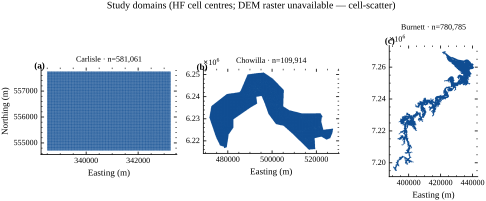

<p class="md-note"><em>说明：Markdown 使用相对路径引用插图；自包含离线要求仅强制适用于 report.html（图为内联 SVG / Base64）。</em></p>


**如何读图（坐标、图例、颜色、指标）**

三面板并排；Easting/Northing；等比例；HF 单元中心散点。无 DEM 栅格时不伪造晕渲。

**逐面板/子图说明**

(a) Carlisle；(b) Chowilla；(c) Burnett。

**可见模式**

单元数约 58万 / 11万 / 78万。

**模式可能原因（因果与时序）**

Geometry_data 提供 XY。

**可结论 / 不可结论**

可以：定位坐标系。不可以：把散点当成高精度 DEM。

**非专业类比**

像先看三张地图轮廓，再谈哪里淹了。

### 图2a Carlisle E1 淹没范围 Hit/Miss/虚警

**为何制作 / 回答什么问题 / 在报告中的角色**

范围对不对：LF 与 LSG 相对 HF 的命中/漏检/虚警（τ=0.03 m）。

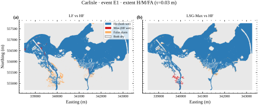

<p class="md-note"><em>说明：Markdown 使用相对路径引用插图；自包含离线要求仅强制适用于 report.html（图为内联 SVG / Base64）。</em></p>


**如何读图（坐标、图例、颜色、指标）**

蓝=Hit；红=Miss；金=False alarm；灰=双方干。左 LF、右 LSG-Max。

**逐面板/子图说明**

Carlisle LF 已较强；看 LSG 是否收紧虚警。

**可见模式**

与湿 CSI≈0.97 量级一致。

**模式可能原因（因果与时序）**

EXT+WSE；Fraehr wet 协议。

**可结论 / 不可结论**

可以：定性支持范围技能。不可以：单事件外推全部折次。

**非专业类比**

像对照金标准淹水足迹。

### 图2b Chowilla E1 淹没范围 Hit/Miss/虚警

**为何制作 / 回答什么问题 / 在报告中的角色**

协议反例可视化：all-cells CSI 低而 wet_train 高。

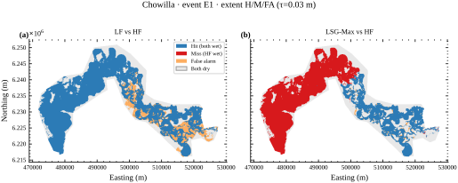

<p class="md-note"><em>说明：Markdown 使用相对路径引用插图；自包含离线要求仅强制适用于 report.html（图为内联 SVG / Base64）。</em></p>


**如何读图（坐标、图例、颜色、指标）**

读法同 2a。

**逐面板/子图说明**

湿掩膜内蓝区主导；掩膜外漏检解释 all-cells。

**可见模式**

湿 CSI≈0.9756，all-cells≈0.3902。

**模式可能原因（因果与时序）**

EXT 学习域=训练湿类别。

**可结论 / 不可结论**

可以：协议教学。不可以：只用 all-cells 否定湿掩膜深度订正。

**非专业类比**

像常考章节与超纲题。

### 图2c Burnett E1 淹没范围 Hit/Miss/虚警

**为何制作 / 回答什么问题 / 在报告中的角色**

弱 LF 上多保真范围订正最直观。

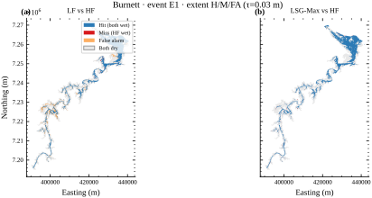

<p class="md-note"><em>说明：Markdown 使用相对路径引用插图；自包含离线要求仅强制适用于 report.html（图为内联 SVG / Base64）。</em></p>


**如何读图（坐标、图例、颜色、指标）**

读法同 2a；对比左右红/金面积。

**逐面板/子图说明**

LF 更多漏检/虚警；LSG 蓝区扩大。

**可见模式**

CSI 0.8533→0.9752。

**模式可能原因（因果与时序）**

LF 几何粗 → 映射可学订正。

**可结论 / 不可结论**

可以：支持 LSG 主技能源。不可以：E1 外推 18 事件。

**非专业类比**

像快测仪校正后足迹贴近金标准。

### 图3a Carlisle E1 峰值水深误差图

**为何制作 / 回答什么问题 / 在报告中的角色**

范围之后看深度：LF−HF 与 LSG−HF 红蓝发散。

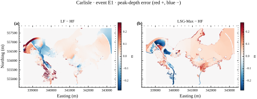

<p class="md-note"><em>说明：Markdown 使用相对路径引用插图；自包含离线要求仅强制适用于 report.html（图为内联 SVG / Base64）。</em></p>


**如何读图（坐标、图例、颜色、指标）**

红=高估，蓝=低估。

**逐面板/子图说明**

误差幅度通常小于 Burnett。

**可见模式**

与湿 RMSE≈0.09–0.10 m 量级一致。

**模式可能原因（因果与时序）**

最大淹没面深度差。

**可结论 / 不可结论**

可以：空间化深度技能。不可以：色条极值当全域均匀误差。

**非专业类比**

像温度偏差图。

### 图3b Chowilla E1 峰值水深误差图

**为何制作 / 回答什么问题 / 在报告中的角色**

强 LF 范围下深度仍可大幅订正。

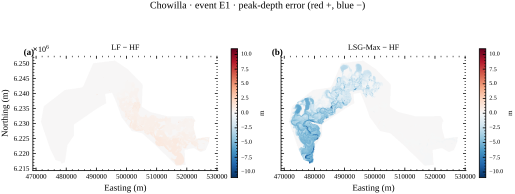

<p class="md-note"><em>说明：Markdown 使用相对路径引用插图；自包含离线要求仅强制适用于 report.html（图为内联 SVG / Base64）。</em></p>


**如何读图（坐标、图例、颜色、指标）**

读法同 3a。

**逐面板/子图说明**

LF 大幅红/蓝；LSG 变浅。

**可见模式**

湿 RMSE LSG≈0.093 m。

**模式可能原因（因果与时序）**

WSE+EXT。

**可结论 / 不可结论**

可以：深度订正叙事。不可以：与 all-cells CSI 混谈。

**非专业类比**

像范围对了仍需校正深浅。

### 图3c Burnett E1 峰值水深误差图

**为何制作 / 回答什么问题 / 在报告中的角色**

弱 LF 深度误差最大、LSG 订正最醒目。

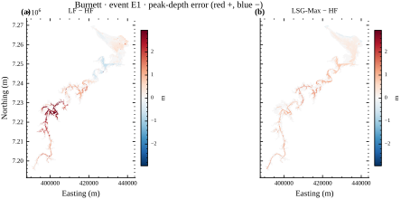

<p class="md-note"><em>说明：Markdown 使用相对路径引用插图；自包含离线要求仅强制适用于 report.html（图为内联 SVG / Base64）。</em></p>


**如何读图（坐标、图例、颜色、指标）**

读法同 3a。

**逐面板/子图说明**

左深红；右近白。

**可见模式**

RMSE 0.989→0.387 m。

**模式可能原因（因果与时序）**

多保真映射。

**可结论 / 不可结论**

可以：支持大 RMSE 降幅。不可以：忽略容量对照。

**非专业类比**

像偏差快测水深被校正。

### 图4a Carlisle E1 P(wet)

**为何制作 / 回答什么问题 / 在报告中的角色**

确定性地图之后的概率层。

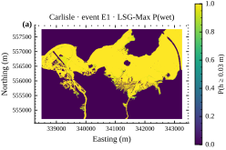

<p class="md-note"><em>说明：Markdown 使用相对路径引用插图；自包含离线要求仅强制适用于 report.html（图为内联 SVG / Base64）。</em></p>


**如何读图（坐标、图例、颜色、指标）**

viridis 0–1。

**逐面板/子图说明**

对照图2边缘过渡。

**可见模式**

均值约 0.36。

**模式可能原因（因果与时序）**

GP 后验。

**可结论 / 不可结论**

可以：UQ 地图。不可以：未看 CRPS 当决策概率。

**非专业类比**

像概率图层叠在足迹之后。

### 图4b Chowilla E1 P(wet)

**为何制作 / 回答什么问题 / 在报告中的角色**

同 4a；均值约 0.31。

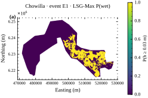

<p class="md-note"><em>说明：Markdown 使用相对路径引用插图；自包含离线要求仅强制适用于 report.html（图为内联 SVG / Base64）。</em></p>


**如何读图（坐标、图例、颜色、指标）**

读法同 4a。

**逐面板/子图说明**

结合图2b。

**可见模式**

均值约 0.31。

**模式可能原因（因果与时序）**

同 4a。

**可结论 / 不可结论**

联系图8 Chowilla 标定持平。

**非专业类比**

概率不能掩盖协议差异。

### 图4c Burnett E1 P(wet)

**为何制作 / 回答什么问题 / 在报告中的角色**

同 4a；均值约 0.55。

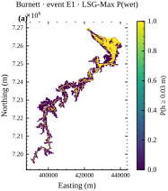

<p class="md-note"><em>说明：Markdown 使用相对路径引用插图；自包含离线要求仅强制适用于 report.html（图为内联 SVG / Base64）。</em></p>


**如何读图（坐标、图例、颜色、指标）**

读法同 4a。

**逐面板/子图说明**

与图2c/3c 对照。

**可见模式**

均值约 0.55。

**模式可能原因（因果与时序）**

同 4a。

**可结论 / 不可结论**

可以对照阅读。不可以单事件外推。

**非专业类比**

概率与确定性订正应同向。

### 图5 跨案例 CSI 与湿训练 RMSE

**为何制作 / 回答什么问题 / 在报告中的角色**

地图之后的统计总览。

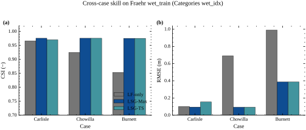

<p class="md-note"><em>说明：Markdown 使用相对路径引用插图；自包含离线要求仅强制适用于 report.html（图为内联 SVG / Base64）。</em></p>


**如何读图（坐标、图例、颜色、指标）**

横轴案例，纵轴 CSI/RMSE。

**逐面板/子图说明**

Burnett 抬升最大。

**可见模式**

Burnett CSI 0.8533→0.9752。

**模式可能原因（因果与时序）**

弱 LF → 映射可学。

**可结论 / 不可结论**

可以：点技能格局。不可以：据此称分区是 CSI 主因。

**非专业类比**

像先看天气图再看统计表。

### 图6 O1–O4 误差预算

**为何制作 / 回答什么问题 / 在报告中的角色**

RQ2：误差部件。

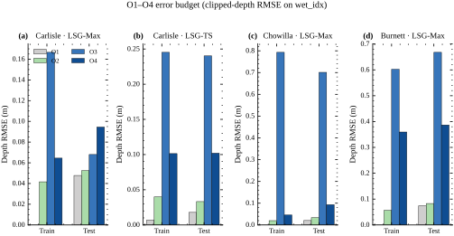

<p class="md-note"><em>说明：Markdown 使用相对路径引用插图；自包含离线要求仅强制适用于 report.html（图为内联 SVG / Base64）。</em></p>


**如何读图（坐标、图例、颜色、指标）**

O1–O4 RMSE。

**逐面板/子图说明**

按案例分面。

**可见模式**

Carlisle Max O2−O1≈0.005。

**模式可能原因（因果与时序）**

神谕阶梯。

**可结论 / 不可结论**

可以：定位误差。不可以：O4=无能。

**非专业类比**

像体检分项。

### 图7 Global vs H-LSG

**为何制作 / 回答什么问题 / 在报告中的角色**

分区帮在哪里（原生容量）。

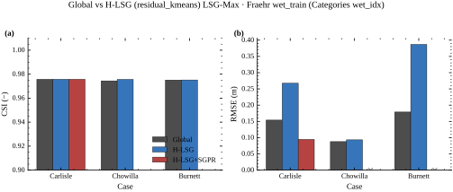

<p class="md-note"><em>说明：Markdown 使用相对路径引用插图；自包含离线要求仅强制适用于 report.html（图为内联 SVG / Base64）。</em></p>


**如何读图（坐标、图例、颜色、指标）**

CSI/RMSE 并排。

**逐面板/子图说明**

湿 CSI 接近；O2−O1 更小。

**可见模式**

Chowilla H-LSG 0.9756 vs global 0.9744。

**模式可能原因（因果与时序）**

残差基压缩截断。

**可结论 / 不可结论**

可以：截断间隙。不可以：CSI 冠军（需等容量）。

**非专业类比**

像大趋势上叠局部修正。

### 图8 CRPS 方差标定

**为何制作 / 回答什么问题 / 在报告中的角色**

RQ3：概率可校准？

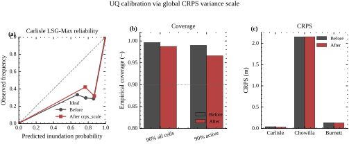

<p class="md-note"><em>说明：Markdown 使用相对路径引用插图；自包含离线要求仅强制适用于 report.html（图为内联 SVG / Base64）。</em></p>


**如何读图（坐标、图例、颜色、指标）**

前后 CRPS/coverage/s。

**逐面板/子图说明**

Carlisle/Burnett 改善；Chowilla 持平。

**可见模式**

Carlisle CRPS 0.039→0.028。

**模式可能原因（因果与时序）**

标量 s。

**可结论 / 不可结论**

不可以：声称三案例均成功。

**非专业类比**

像把±10°C 改口±4°C。

### 图9 Chowilla wet_correlation 敏感性

**为何制作 / 回答什么问题 / 在报告中的角色**

分区超参敏感性。

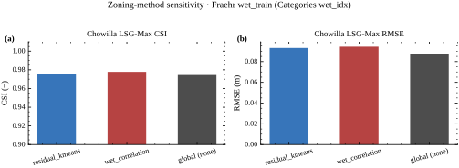

<p class="md-note"><em>说明：Markdown 使用相对路径引用插图；自包含离线要求仅强制适用于 report.html（图为内联 SVG / Base64）。</em></p>


**如何读图（坐标、图例、颜色、指标）**

CSI/RMSE 柱。

**逐面板/子图说明**

边际差很小。

**可见模式**

wet CSI：global 0.9744；H-LSG 0.9756；wet_correlation 0.9778。

**模式可能原因（因果与时序）**

相关分区改变残差聚合。

**可结论 / 不可结论**

可以：单折敏感性。不可以：宣称全面更优。

**非专业类比**

像换行政区划重画修正层。


## 分案例结果

### Carlisle（主）

- LF-only：CSI(all)=0.9602，RMSE=0.074 m
- LSG-Max（H-LSG+SGPR fix）：CSI=0.9757，RMSE(all)=0.061，RMSE(wet)=0.094 m
- LSG-TS max-surface：CSI=0.9702，RMSE(all)=0.099 m
- 与 Fraehr 发表 LSG（Grp E1，湿单元 EXT+WSE）CSI≈0.969 同量级（README 对照表）

### Chowilla（次；协议反例）

- LF 已很强：CSI(all)≈0.9305
- LSG-Max H-LSG：CSI(all)≈0.3902 vs CSI(wet)≈0.9756；RMSE(wet)≈0.093 m（相对 LF 湿 RMSE≈0.690 大幅下降）
- 解释：EXT 在训练湿掩膜上学习；all_cells 暴露掩膜外系统偏差——必须双报协议

### Burnett（第三）

- LF CSI≈0.8533，RMSE≈0.989 m
- LSG-Max H-LSG CSI≈0.9752，RMSE≈0.387 m
- LSG-Max global CSI≈0.9751，RMSE≈0.179 m；O2−O1 global≈0.049 vs H-LSG≈0.009
- 这是“多保真 LSG 为主技能源”的最清晰跨案例证据；但 H-LSG 虽有更小 O2−O1，其 wet RMSE 反而**更差**——见「等容量对照」节：这是 LF→HF GP 映射（O4−O2）退化，而非分区收益，且 matched-18 全局在纯容量下复现同一失败


## 跨案例比较

**表：跨案例点技能（JSON 核验；主协议见列）**

| 案例 | 变体 | 掩膜 | CSI | RMSE (m) | 来源 JSON |
| --- | --- | --- | --- | --- | --- |
| Carlisle | LF only | all_cells | 0.9602 | 0.074 | …sgpr_fix.json |
| Carlisle | LF only | wet_train | 0.9660 | 0.101 | 同上 |
| Carlisle | LSG-TS (max surface) | all / wet_train | 0.9702 / 0.9702 | 0.099 / 0.154 | 同上 |
| Carlisle | LSG-Max H-LSG+SGPR fix | all / wet_train | 0.9757 / 0.9757 | 0.061 / 0.094 | 同上 |
| Chowilla | LF only | all / wet_train | 0.9305 / 0.9247 | 0.690 / 0.690 | …hlsg_max.json |
| Chowilla | LSG-Max H-LSG | all / wet_train | 0.3902 / 0.9756 | 3.789 / 0.093 | 同上；all-cells 反例 |
| Chowilla | LSG-Max global | wet_train | 0.9744 | 0.088 | …global_max.json |
| Chowilla | LSG-Max wet_correlation | wet_train | 0.9778 | 0.094 | …wet_correlation_max.json |
| Burnett | LF only | all / wet_train | 0.8528 / 0.8533 | 0.983 / 0.989 | …hlsg_max.json |
| Burnett | LSG-Max H-LSG | all / wet_train | 0.9752 / 0.9752 | 0.384 / 0.387 | 同上 |
| Burnett | LSG-Max global | wet_train | 0.9751 | 0.179 | …global_max.json |


### 比较命题

1. **技能主源**：Burnett 式弱 LF → LSG 大幅提升；不是 zoning。
2. **分区作用**：看 O2−O1（Chowilla/Burnett global A/B 均已齐），不看 CSI 排行榜。
3. **协议敏感性**：Chowilla all-cells vs wet_train 必须并排出现。
4. **UQ**：三案例均有 before/after；Carlisle/Burnett 改善；Chowilla CRPS 近乎持平、coverage 恶化——如实报告。
5. **分区敏感性**：Chowilla `wet_correlation` 湿 CSI≈0.9778，略高于 H-LSG，仍非 headline。


## 等容量对照实验（局部化不成立）

本节是本轮修订的**核心新增诊断**，用来回答审稿式质疑：H-LSG（层次残差分区）相对全局 EOF 的“优势”，是**真的空间局部化**，还是仅仅**更多容量**（更多保留的 EC、更宽的 GP 输入）造成的假象？我们把 GP 输入维度（`gp_input_dim`）钉死后重跑，结论是：**一旦容量对齐，局部化优势不成立。**

### 怎么读这些表（教学说明）

- **WSE 维度**＝进入 WSE 分支高斯过程的展开系数总数（`capacity.gp_input_dim_wse`）。H-LSG 会把“全局模态 + 各分区残差 EC”叠进去，所以天然比全局基线维度更高——这正是“容量混淆”的来源。
- **O2−O1（截断间隙）**＝在 HF 神谕下，从“只保留 k 个模态”到“全秩”的深度 RMSE 差；它衡量子空间**表达力**。任何增加保留方差的手段（多加分区残差 EC，或多加全局模态）都会缩小它——它奖励的是**容量**，不是**空间分区**本身。
- **RMSE(wet)**＝真正的执行技能（湿掩膜深度误差），才是我们最终关心的量。
- 关键对照逻辑：用 `force_n_modes` 给**全局**模型灌进与 H-LSG **相同**的维度；再用 `residual_eof_modes:0` 把 H-LSG 的残差关掉，看它是否塌回全局基线。

### Chowilla 等容量对照（表 6）

**表：表 6. Chowilla 等容量对照（Grp1 Max, wet_train；数值取自 *_capacity_rerun / *_matched15 / *_budget3 JSON）**

| 模型 | WSE 维度 | CSI(wet) | RMSE(m, wet) | 测试 O2−O1(m) |
| --- | --- | --- | --- | --- |
| 全局（原生） | 3 | 0.9744 | 0.088 | 0.057 |
| H-LSG `residual_kmeans` | 15 | 0.9756 | 0.093 | 0.013 |
| 全局 matched-15（`force_n_modes:15`） | 15 | 0.9752 | 0.085 | 0.002 |
| H-LSG `residual_eof_modes:0` | 3 | 0.9744 | 0.088 | 0.057 |


**解读**：给全局模型灌到 15 维后，它拿到**最低**的 wet RMSE（0.085 m，H-LSG 为 0.093 m，原生 3 模态全局 0.088 m）和**最小**的 O2−O1（0.002 m，H-LSG 0.013 m，原生全局 0.057 m）。把 H-LSG 残差关掉（`residual_eof_modes:0`）后它精确塌回原生全局。所以 6.3 节里归功于“分区”的 O2−O1 收缩，其实只要多留全局模态就能复现——甚至超过——一旦容量对齐，分区在 wet RMSE 上**没有**任何优势。

### Burnett 等容量对照与误差归因（表 7）

**表：表 7. Burnett 等容量对照与神谕归因（Grp1 Max, wet_train / test）**

| 模型 | WSE 维度 | CSI(wet) | RMSE(m, wet) | 测试 O2−O1(m) | 测试 O4−O2(m) |
| --- | --- | --- | --- | --- | --- |
| 全局（原生） | 6 | 0.9751 | 0.179 | 0.049 | 0.056 |
| H-LSG `residual_kmeans` | 18 | 0.9752 | 0.387 | 0.009 | 0.304 |
| 全局 matched-18（`force_n_modes:18`） | 18 | 0.9720 | 0.416 | 0.004 | 0.337 |


**解读**：额外容量（无论来自 H-LSG 残差栈，还是 matched-18 全局）都**缩小 O2−O1 但恶化** wet RMSE：相对原生 6 模态全局（0.179 m），H-LSG 升到 0.387 m，matched-18 全局 0.416 m。神谕阶梯把失败精确定位到 **LF→HF 的 GP 映射**：H-LSG 的 O4−O2＝0.304 m，约为全局（0.056 m）的 5.5 倍；而两模型的 EXT 门控**完全相同**（cell agreement 0.986，见 `diagnose_burnett_hlsg_gap.py` 产出的 `diagnose_hlsg_o2_vs_rmse.json`）。因此这**不是**“extent 门控”故事，而是残差容量让子空间更可表达、却让 GP 更难拟合。

### 诱导点与分区数混淆（表 8）

**表：表 8. Chowilla H-LSG 诱导点与分区数扫描（Grp1 Max, wet_train）**

| 因子 | 设置 | WSE 维度 | CSI(wet) | RMSE(m, wet) | 测试 O2−O1(m) |
| --- | --- | --- | --- | --- | --- |
| 诱导点 `min_inducing_points` | 2 | 15 | 0.9467 | 0.244 | 0.013 |
|  | 8 | 15 | 0.9899 | 0.096 | 0.013 |
|  | 16（默认） | 15 | 0.9756 | 0.093 | 0.013 |
|  | 28（= n_train） | 15 | 0.9825 | 0.073 | 0.013 |
| 分区数 `n_zones` | 2 | 9 | 0.9752 | 0.087 | 0.019 |
|  | 4（默认） | 15 | 0.9756 | 0.093 | 0.013 |
|  | 6 | 21 | 0.9754 | 0.103 | 0.012 |


**解读**：两个“干扰因子”对 RMSE 的影响不亚于分区本身。在 15 维 WSE 输入下，SGPR 诱导点预算主宰深度 RMSE 而 O2−O1 几乎不变（m=2 时 RMSE 0.244 m；m=28 时降到 0.073 m），而 3 维全局在 m=2 时仍稳（约 0.085 m）——低 m 的 H-LSG 崩溃很容易被误读成“分区有害”。另一方面，`n_zones` 从 2 增到 6 单调缩小 O2−O1（0.019 → 0.012 m）却**恶化** wet RMSE（0.087 → 0.103 m）：更多分区＝更多 GP 无法利用的 EC 容量。两组扫描都指向容量/近似解释，而非局部化解释。

### CRPS 尺度的折稳定性（方法学检查）

官方测试折在 Chowilla 只有 1 个事件，可能担心 CRPS 方差尺度 *s* 是脆弱的单次拟合。8 折留一训练事件交叉验证给出 *s* = 0.310 ± 0.007（范围 0.298–0.324），围绕全训练值 0.309，说明该标量在重采样下稳定。这**不**声称 Chowilla 标定有用（6.5 节报告其 CRPS 持平、coverage 恶化），只说明该零结果不是估计器不稳造成的（来源 `nested_crps_scale_cv.json`）。

### 本节结论（写进正文的底线）

1. **不要**在未陈述上述等容量负对照的情况下，声称 H-LSG“因局部化”而在深度 RMSE 上胜过全局 EOF。
2. H-LSG 最诚实的定位是**带等容量对照的截断间隙（O2−O1）诊断工具**，而非 CSI/RMSE 升级。
3. 在 **Burnett** 上要明说：H-LSG 通过 **GP/LF 映射（O4−O2）** 恶化 wet RMSE，而非 EXT 门控；matched-18 全局在纯容量下复现同一失败模式。


## 讨论与因果分析

### 主因果叙事（锁定）

1. **多保真 LSG vs LF** 是技能主效应（Burnett 最清晰；Carlisle 在高位微调；Chowilla 深度 RMSE 在湿掩膜上大幅下降）——技能在多保真映射，不在局部化。
2. **残差分区的表观优势是容量混淆**：等容量对照（表 6–8）显示，对齐 GP 维度后全局模型复现/超越 O2−O1 收缩，Chowilla 上 matched-15 全局 wet RMSE 更低；O2−O1 奖励的是保留方差（容量），不是空间分区。
3. **Burnett 的失败机制**：残差容量让子空间更可表达（O2−O1 更小），却让 LF→HF GP 映射退化（O4−O2 约 5.5×），EXT 门控相同——不是 extent 故事；matched-18 全局在纯容量下复现同一失败。
4. **干扰因子**：SGPR 诱导点预算与 `n_zones` 对 RMSE 的影响不亚于分区；低 m 的 H-LSG 崩溃易被误读为“分区有害”。方法论文必须报告这些近似/容量因子。
5. **UQ 标定** 解决过宽区间；与点估计正交（CRPS 尺度经嵌套 CV 证明折稳定）。
6. **Chowilla all-cells** 是评分协议与 EXT 学习域的相互作用，应作为结果写进正文，而非附录藏匿。

### 开放科学问题（来自进度评论）

1. O2−O1 作为诊断很有信息量，但与执行技能解耦——未来应报告“容量匹配后的留出技能”而非单看 O2−O1。
2. 强 LF 反例的社区评分规范应如何标准化？
3. `var_scale` 能否跨事件/站点迁移而不重拟合？（**关闭局限**：Chowilla 标定已近乎持平且 coverage 恶化，说明不可默认跨站迁移；本报告不追加新实验）
4. 与 REOF-SGP、Tan 区域化 LSG 的精细边界还需对照表持续维护；未来局部 EOF 洪水代理应默认报告等容量基线。


## 创新点

**表：创新点 vs 既往工作（有边界）**

| 主张 | 相对既往工作的边界 | 本仓库证据 |
| --- | --- | --- |
| 残差层次分区 LSG 的**等容量负结果**（capacity-controlled negative result） | ≠ REOF-SGP（Wang 2025）；≠ Tan 2025 单焦点区域重训；对 Wang 2026 点名的 zonal EOF 给出容量对照下的**否定**评估 | force_n_modes 匹配容量 + 诱导点/分区数扫描：表观 O2−O1 优势是容量混淆，不转化为留出技能（表 6–8） |
| CRPS 尺度标定的 LSG 地图后验方差 | ≠“首个概率淹没代理”（已有多种非 LSG GP/PCE UQ） | Carlisle Max s≈0.417，CRPS 0.039→0.028；均值不动 |
| O1–O4 神谕阶梯 | ≠ Tan 的两段式 ER_DR/ER_LSG；本报告为四段反事实深度 RMSE | 三案例 test budgets 可复现 |
| SGPR 诱导点下限与训练行初始化 | 工程稳健性，非 headline 新颖性 | Max pre-fix O4=0.267 → post-fix 0.094 |


## 可复现性与质量保证

**表：测试与可复现记录**

| 项目 | 记录 | 本报告是否重跑 |
| --- | --- | --- |
| pytest | docs/paper/03_new_results.md：80 passed, 1 skipped（本会话实验后；进度评论旧记 74） | 本文档构建未强制重跑；以 03_new_results 记录为准 |
| 评价协议 | threshold 0.03 m；all_cells + wet_train；Fraehr Categories wet_idx | 复述文档 |
| 随机种子 | config 中 random_seed: 20260814（Carlisle） | — |


### 推荐复现命令

```powershell
.\.venv\Scripts\Activate.ps1
python scripts/run_lsg_workflow.py --config config/carlisle.yaml
python scripts/run_lsg_workflow.py --config config/chowilla.yaml
python scripts/run_lsg_workflow.py --config config/burnett.yaml
python scripts/rescore_uq_calibrated.py --config config/carlisle.yaml
.\.venv\Scripts\python.exe -m pytest tests -q
```

### 工件索引（摘要）

- Carlisle 主结果：`outputs/evaluation/carlisle/workflow_summary_full_Grp1_wse_ext_hlsg_sgpr_fix.json`
- Carlisle UQ：`..._uq_calibrated.json`
- Chowilla H-LSG / global / wet_correlation：`..._hlsg_max.json` / `..._global_max.json` / `..._wet_correlation_max.json`
- Chowilla/Burnett UQ rescore：`..._hlsg_max_uq_calibrated.json`
- Burnett H-LSG / global：`..._hlsg_max.json` / `..._global_max.json`
- 图：`outputs/figures/fig01`–`fig06_*`（manifest skips=[]）


## 局限性

**表：局限性与缺口**

| 限制 / 边界 | 状态 | 影响 |
| --- | --- | --- |
| Chowilla / Burnett 全时序 Grp1 折 | 计算边界（Burnett HF≈199 GB ≫ ≈128 GB RAM） | 等容量结论建立在 Max 面折上，不可定量外推全时序 |
| 等容量 global vs H-LSG（Chowilla/Burnett Max） | **已完成**（force_n_modes + 诱导点/分区数扫描） | Chowilla/Burnett：局部化优势不成立 |
| Carlisle 等容量对照 | **已完成**（force 13→实现 8；见 docs/paper/05_carlisle_capacity.md） | Max 训练秩限制下残差堆叠可改善 RMSE；与 Chowilla/Burnett 异质 |
| residual_kmeans 空间连通性 | Carlisle 8-NN 同区占比≈0.95（含 XY） | 局部相干，但算法不施加连通性硬约束 |
| CRPS s 嵌套 CV | Chowilla + Carlisle 已完成；Burnett 不在本轮范围 | s 折稳定≠跨站可迁移；Chowilla 标定仍可持平/不利 |
| O1–O4 | 路径有序反事实阶梯 | 非可加、非顺序不变的方差分解 |
| Carlisle/Chowilla Max 测试事件数 | N_event=1（Burnett=18） | 受控效应量对比，非 p 值检验 |
| Brisbane / FloodCastBench | 许可/外部基准，移出公开证据链 | 仅作未来外部复现方向 |
| 跨事件/站点的 var_scale 迁移 | 开放问题 | 当前每案例重拟合 |


## 未来工作

1. 内存或流式摄取允许时，对 Chowilla/Burnett 全时序 Grp1 做等容量对照（当前主机不可行）。
2. 连通性约束或流域分区与残差响应分区的对照研究（另一篇工作，而非本稿未完成项）。
3. Burnett 的 CRPS *s* 嵌套 CV；跨站点 `var_scale` 迁移实验。
4. 许可到来后的 Brisbane 与其他公开多保真基准的等容量复现。
5. 发展“容量匹配后可预测局部化增益”的训练期判据（若存在）。


## 结论

在三个公开多保真案例上，本项目复现并扩展了 LSG 栈：EXT+WSE 双场、SGPR 诱导点稳健化、CRPS 方差标定与 O1–O4 神谕预算，并对残差层次分区做了**等容量对照**。关于局部化：Chowilla/Burnett 上一旦对齐 GP 输入维度，残差分区在 O2−O1 上的表观优势会被等容量全局模型复现或超越，且不转化为留出深度技能（Burnett 上额外残差容量经退化的 LF→HF GP 映射恶化 RMSE）。Carlisle Max 在 *n*_train=8 的秩上限下呈现异质：残差堆叠改善 wet RMSE（0.094 vs 原生全局 0.112 m），而把全局容量拉满至秩上限（实现维 8）反而恶化 RMSE（0.202 m）。**可辩护的核心**依然成立：多保真 LSG 在弱 LF 情景提供主要技能；O1–O4 阶梯定位误差部件；CRPS 方差标定在 Carlisle/Burnett 改善可靠性而**按构造**不动 CSI/RMSE，在 Chowilla Max 上 CRPS 近乎持平；残差层次分区最宜用作**截断诊断**，并在等容量与站点约束下报告，而非普遍精度升级。评价单元是 hold-out 事件，不是栅格单元。所有结论均锚定于本仓库 JSON/图件，可独立复核。


## 数据与代码可用性

- 公共立方体：Figshare DOI [10.26188/24312658](https://doi.org/10.26188/24312658)（CC BY 4.0）。
- 本仓库配置与脚本：`config/*.yaml`、`lsg/`、`scripts/`（无密钥）。
- Brisbane TUFLOW/URBS：昆士兰州政府许可，需申请；本地为 missing。
- Hybrid LSG 参考代码：https://github.com/nfraehr/Hybrid_LSG_model


## 参考文献

1. Fraehr, N., Wang, Q. J., Wu, W., & Nathan, R. (2022). Water Resources Research, 58, e2022WR032248. https://doi.org/10.1029/2022WR032248
2. Fraehr, N., Wang, Q. J., Wu, W., & Nathan, R. (2023). Water Resources Research, 59, e2022WR033836. https://doi.org/10.1029/2022WR033836
3. Fraehr, N., et al. (2023). Nature Water. https://doi.org/10.1038/s44221-023-00132-2
4. Fraehr, N., Wang, Q. J., Wu, W., & Nathan, R. (2024a). Assessment of surrogate models for flood inundation: The physics-guided LSG model vs. state-of-the-art machine learning models. Water Research, 252, 121202. https://doi.org/10.1016/j.watres.2024.121202
4b. Fraehr, N., Wang, Q. J., Wu, W., & Nathan, R. (2024b). Generation and selection of training events for surrogate flood inundation models. Journal of Environmental Management, 373, 123570. https://doi.org/10.1016/j.jenvman.2024.123570
5. Wang, W., Wang, Q. J., & Nathan, R. (2026). Water Resources Research, 62, e2025WR042481. https://doi.org/10.1029/2025WR042481
6. Lu et al. (2025). Journal of Hydrology. https://doi.org/10.1016/j.jhydrol.2025.132949
7. Tan et al. (2025). HESS, 29, 3833. https://doi.org/10.5194/hess-29-3833-2025
8. Wang, R. et al. (2025). REOF-SGP. https://doi.org/10.1007/s13753-025-00642-5
9. Fraehr (2024) datasets. https://doi.org/10.26188/24312658
10. 其余概率代理与 FIER 文献见 `docs/paper/01_literature_review.md`。


## 附录

### A. 术语与符号表

**表：术语与符号词汇表**

| 中文名 | 英文全称 | 缩写/符号 | 物理意义 | 方程/流程位置 | 本项目引入原因 |
| --- | --- | --- | --- | --- | --- |
| 低保真—空间分析—高斯过程学习 | Low-fidelity, Spatial analysis, and Gaussian Process Learning | LSG | 多保真淹没代理总方法 | 全管道 | 研究对象 |
| 高精度 / 低精度 | High-/Low-fidelity | HF / LF | 细/粗水动力解 | 输入场 | 多保真设定 |
| 经验正交函数 | Empirical Orthogonal Function | EOF | 空间模态基 | 降维 | 压缩淹没场 |
| 展开系数 | Expansion Coefficient | EC / 伪 EC | 模态时间/事件系数；伪 EC 来自 LF 投影 | GP 输入 | 建立 LF→HF 学习 |
| 淹没范围 / 水面高程 | Extent / Water-Surface Elevation | EXT / WSE | 湿干与水面 | 双场重构 | 降虚警、近发表 CSI |
| 层次残差 LSG | Hierarchical residual LSG | H-LSG | 全局+残差分区 | WSE 残差 | 实现 zonal future work |
| 稀疏高斯过程回归 | Sparse Gaussian Process Regression | SGPR | 诱导点近似 GP | 模态映射 | 可扩展回归 |
| 诱导点 | Inducing points | Z / m | 稀疏近似支撑集 | SGPR | Max 路径数值稳健 |
| 临界成功指数 | Critical Success Index | CSI | hits/(hits+misses+FA) | 点技能 | 淹没范围技巧 |
| 均方根误差 | Root Mean Square Error | RMSE | 水深误差均方根 | 点技能 | 深度精度 |
| 连续分级概率评分 | Continuous Ranked Probability Score | CRPS | 概率预报评分 | UQ 目标 | 方差标定 |
| 神谕误差阶梯 | Oracle error budget | O1–O4 | 反事实误差分解 | 诊断 | 归因 |
| 残差 | Residual | ε | 全局重构后的剩余场 | 分区 EOF | 局部修正 |
| 湿训练掩膜 | Fraehr wet_train mask | wet_train | 训练湿类别单元 | 评分 | 与发表表对齐 |


### B. 工件索引

| 类别 | 路径 |
| --- | --- |
| 进度/文献/框架 | `docs/paper/00_progress_review.md` 等 |
| 评价 JSON | `outputs/evaluation/{carlisle,chowilla,burnett}/` |
| 图件 | `outputs/figures/fig01*`–`fig06*` |
| 配置 | `config/{carlisle,chowilla,burnett,burnett_global,chowilla_wet_correlation}.yaml` |
| 核心代码 | `lsg/{gp,zoning,uq,diagnostics,wse_ext,fraehr}.py` |
| 本报告 | `docs/report/report.{html,md,pdf}` |


## 范围边界与本轮已完成项

1. Chowilla / Burnett **全时序** Grp1 — 计算边界（Burnett HF≈199 GB ≫ ≈128 GB RAM）；等容量结论建立在 Max 面。
2. Brisbane / FloodCastBench — 移出公开证据链，仅未来外部复现。
3. Burnett CRPS *s* 嵌套 CV、容量×分区×站点完整析因、oracle 顺序置换 — 不构成本稿逻辑缺口。

**本轮已完成：** Chowilla/Burnett 等容量对照；Carlisle 等容量对照（秩上限说明，见 `docs/paper/05_carlisle_capacity.md`）；Chowilla+Carlisle CRPS *s* 嵌套 CV；Carlisle 区划 8-NN 相干诊断；硬件/软件版本钉扎；手稿开放占位符已全部改为关闭局限表述。

**Carlisle 等容量教学要点（wet_train）：** H-LSG 维 13 → RMSE 0.094 m；原生全局维 1 → 0.112 m；`force_n_modes: 13` 受 *n*_train=8 限制实现为维 8 → RMSE 0.202 m 且 O2−O1=0；`residual_eof_modes: 0` 坍缩回原生全局。精确维 13 的全局匹配在 Max 路径上不可行。


---

**状态声明：** 工作区 `20260522-LSG-WRR` 仍无 `.git`；公开镜像通过 staging 副本 `I:\Projects\_publish_lsg-flood-surrogate-benchmark` 推送到 https://github.com/Coucou2016/lsg-flood-surrogate-benchmark （等容量负结果修订）。
